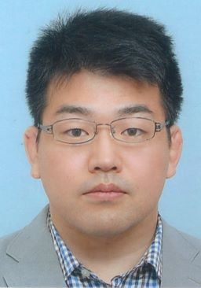

### Seitaro SHINAGAWA/品川 政太朗 (CV)  

I'm a PhD. student of Augment Human Communication laboratory (<a href="http://ahclab.naist.jp/index_en.html">AHC-lab</a>), Graduate
School of Information Science, Nara Institute of Science and Technology (NAIST), Japan

### Contact
- Mail: shinagawa.seitaro.si8_is.naist.jp (replace underbar with @)   
- Address:   

  (EN) Augmented Human Communication Laboratory
  Graduate School of Information Science
  Nara Institute of Science and Technology
  8916-5 Takayama-cho, Ikoma, Nara 630-0101, Japan

  (JA) 〒630-0101
  奈良県生駒市高山町8916-5
  奈良先端科学技術大学院大学情報科学研究科
  知能コミュニケーション研究室

### Research Interest
Dialogue-based Image Generation, Visually-grounded dialogue systems, Human-in-the-loop machine learning, Symbol Grounding, Neural Ne
tworks, Machine Learning, Artificial Intelligence

### Concept of Dialogue-based Image Generation
Creating an image or illustration is a special skill for us and it takes much time. I believe that an image generation system consid
ering natural language interaction can encourage communication between a lot of creators and clients.

### Past Project Demo: Image manipulation with natural language instruction
[video download (mp4, 3.53MB)](https://github.com/SeitaroShinagawa/SeitaroShinagawa.github.io/blob/master/contents/demo_IMI.mp4)    
[[paper](https://ahcweb01.naist.jp/papers/conference/2018/201808_MIRU_seitaro-s_1/201808_MIRU_seitaro-s_1.paper.pdf)], [[poster](https://ahcweb01.naist.jp/papers/conference/2018/201808_MIRU_seitaro-s_1/201808_MIRU_seitaro-s_1.poster.pdf)], 
  
  
  
  Implemented with [telegram bot](https://github.com/python-telegram-bot/python-telegram-bot)
  
  Getting started:
  1. Create telegram account (if you don't have)
  2. Access to [AIMIdemo_bot](https://t.me/AIMIdemo_bot) and start to play!  
  
  How to play:
  1. An image is provided.
  2. You can provide natural language instruction to change the given image
  3. You can do 2. repeatedly until you are satisfied
  (optional: input "/new" to start with a new image)

  Notes: 
  - This demo is the proposed (w/ Source image masking) model
  - This model is fully data-driven and trained by the end-to-end manner
  - Editable contents: hair, eyebrows, eyes, ears, earlobes, nose, cheeks, mustache, mouth, lips, beard, chin

### Skills
Python (mainly use), Matlab, C, C++

### Work Experience
- <b>Research Assistant (2017-present)</b> at RIKEN, Center for Advanced Intelligence Project AIP
- <b>Research Assistant (2015-present)</b> at Nara Institute of Science and Technology, Supervisor: Satoshi NAKAMURA
- <b>Teaching Assistant (2014)</b> at the Department of Information and Intelligent Systems, Tohoku University, Experiment A: the basi
c phenomena associated with Electrical Engineering

### History
2009 - 2013, Tohoku University
- Bachelor degree of Engineering, Graduated from Intelligence Computing course, Engineering, Supervisor: Koji NAKAJIMA
- <b>Bachelor thesis</b>, "nullclineによるHodgkin-Huxley近似方程式の動作と結合特性の解析", Supervisor: Koji NAKAJIMA

2013 - 2015, Tohoku University
- Master degree of Information Science, Graduated from Applied Information Sciences, Graduate School of Information Sciences, Supervisor: Koji NAKAJIMA
- <b>Master Thesis</b>, "量子化結合ニューラルネットワークの深層学習に関する研究" ("A Study of Deep Neural Networks with Quantized Weights"), Supervisor: Koji NAKAJIMA

2015 -, Nara Institute of Science and Technology(NAIST)  
I'm currently a Ph.D student of Augmented Human Communication laboratory(AHC-lab), Graduate School of Information Sciences, Supervisor:
 Satoshi NAKAMURA

2019 March 14 - June 19, Internship at The University of Southern California Institute for Creative Technologies  
Collaborate with David TRAUM lab

### Publication
<b>Journal Papers (Reviewed)</b>  
- Seitaro Shinagawa, Koichiro Yoshino, Sakti Sakriani, Yu Suzuki, Satoshi Nakamura.
Image Manipulation System with Natural Language Instruction
IEICE Transactions on Information and Systems, Vol.J102-D, No.8, pp.514--529, August, 2019. [PDF](https://search.ieice.org/bin/summary_advpub.php?id=2018IUT0001&category=D&lang=J&abst=)

<b>Conference Papers(Reviewed)</b>  
- S.Shinagawa, K.Yoshino, S.Sakuriani, Y.Suzuki, S.Nakamura, ”Interactive image manipulation with natural language instruction comma
nds, NIPS workshop, 2017

<b>Conference Papers(no review)</b>
- 浅井 沙良，品川 政太朗，吉野 幸一郎，サクリアニ サクティ，中村 哲，“説得対話システムにおける感情表現を反映させた応答生成モデルの構築”，情報処理学会第240回自然言語処理研究会，2019

- Seitaro Shinagawa, Koichiro Yoshino, Sakriani Sakti, Yu Suzuki, Satoshi Nakamura, "Interactive Avatar Image Manipulation with Unconst
rained Natural Language Instruction using Source Image Masking", The 21st Meeting on Image Recognition and Understanding (MIRU), OS2-S3
, 2018 【Selected as short oral】【Student Award】

- 品川 政太朗，吉野 幸一郎，サクティ サクリアニ，中村 哲，“DNNによる画像操作システム”，電子情報通信学会パターン認識・メディア理解
PRMU）研究会，2017【PRMU月間ベストプレゼンテーション賞】

- 生田 和也, 品川 政太朗, 吉野 幸一郎, 鈴木 優, 中村 哲，“伝達内容を考慮して言語化するニューラル言語生成の検討”，情報処理学会 第232
回自然言語処理（NL）研究会，2017

- 品川政太朗，吉野幸一郎、ニュービッググラム，中村哲,“キャプションからの画像生成を行うニューラルネットへの対話的修正の導入と検討”
2016年度人工知能学会全国大会，1A4-OS-27b-4,2016

- 品川政太朗，早川吉弘，中島康治，“量子化結合ニューラルネットワークの多層化による認識精度の向上”，2015年電子情報通信学会総合大会，I
SS-SP-217,2015

- Seitaro Shinagawa，Yoshihiro Hayakawa，Koji Nakajima，“Mitigation of degrading with weight quantization in deep neural networks”,
 The 3rd RIEC International Symposium on Brain Functions and Brain Computer, 2015

- 品川政太朗，早川吉弘，小野美武，中島康治，“プレトレーニングで得られるディープニューラルネットワークの学習初期値に関する考察”，信>
学技報，vol.114,No.326,NC2014-27(2014-11),pp.11-14,2014

- 品川政太朗，早川吉弘，佐藤茂雄，小野美武，中島康治，“学習パラメータを離散化した制限付きボルツマンマシンの学習の検討”，信学技報 vo
l.114,No.113, NLP2014-06-30,pp.37-40,2014

- 品川政太朗，佐藤茂雄，早川吉弘，中島康治，“深層学習のハードウェア化を目指した荷重値離散化RBMの学習に関する研究”，2013年電子情報通
信学会総合大会，ISS-P-252,2014

